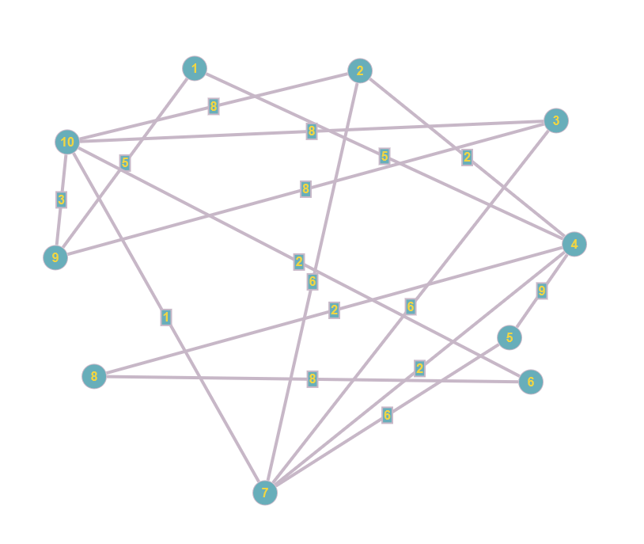

# CA2: Finding Cycles in A Graph

## Info
**Course:** ORI391Q – Integer Programming

**Date:** 2/23/2023

**Authors:**
Hannah Amundson
Rohit Ashok
Rishi Dubey

## Problem Statement
There are two parts to this assignment. Part one is to create a connected, weighted, no self-loop, undirected graph 
with a given edge density and a minimum degree of 2. Part two is to find all cycles in a connected, undirected graph 
with a minimum degree of 2. 

## Algorithm
Code for both parts of the problem start in [App.java](ca2/src/main/java/com/digit/app/App.java).

### Part 1: Create A Graph
If you are trying to follow along, most of this can be found in 
[GraphGenerator.java](ca2/src/main/java/com/digit/app/GraphGenerator.java). The main steps are found in the method
`GraphGenerator.create()`.

**Input:** 
<br>`numberOfNodes`: the total number of nodes you want in your graph
<br>`density`: the density of the graph; the percentage of edges of a clique that you would like added

**Output:**
<br>The requested graph

**Steps:**
1. Generate the initial graph.
   1. Keep track of this graph by generating a `numberOfNodes - 1` x `numberOfNodes - 1` matrix that will store the
   weight of an edge if it exists.
   3. For every node `v` from [1, `numberOfNodes`], take every node `w` that is larger than it. Randomly generate a 
   probability `p`. 
   3. If this number `p` is less than `density`, create an edge between `v` and `w`. Give this edge a weight
   of a randomly generated integer between 1 and 10.
   4. Store this edge and weight in the matrix.
2. Ensure each node has a minimum degree of 2.
   1. We need to see how many nodes are adjacent to any given node. We can do this by iterating through every node in 
   the matrix. 
   4. If any node doesn't have more 2 or more nodes, connect it to another random node that it isn't already
   connected to until it has 2 adjacent nodes. If it attempts to connect to itself, draw a new node number to connect it
   to.
3. Ensure the graph is connected.
   1. Find all the nodes node 1 is connected to (whether directly or indirectly through other nodes) using depth first 
   search. Return all the nodes that are not connected to node 1, if any.
   5. If there are any nodes that are not connected to node 1, select two distinct nodes from the list and connect each 
   one to a distinct node that is connected to node 1. Generate a random integer between 1 and 10 for this edge's 
   weight. Add it to the graph matrix.
   6. Start from the top of part 3 until node 1 is connected to all nodes.
4. Return the graph.
   1. Return the graph matrix that was created in the above steps.


### Part 2: Find All Cycles
If you are trying to follow along, most of this can be found in
[CycleDetection.java](ca2/src/main/java/com/digit/app/CycleDetection.java). The major steps are split in the method
`CycleDetection.findCycles()`.

**Input:**
<br>`graph`: the matrix of the graph from part one

**Output:**
<br>A list of all cycles in the graph

**Steps:**
1. Run Patton's fundamental set of cycles algorithm to find the cycle basis. 
(Based on this [paper](https://dl-acm-org.ezproxy.lib.utexas.edu/doi/abs/10.1145/363219.363232).) The general idea is to
find cycles as we are finding a spanning tree in the graph. Recall, by definition, a spanning tree touches every node 
in a graph with a minimum number of edges, and it does not have any cycles.
   1. Initialize an array `parents` which holds the node number of a parent for a node as we find it; set the parent of 
   node 1 to itself. Initialize an array `visited` which holds whether a node has been visited; set all elements to 
   false except the node 1. Additionally, create a stack `nodesToLookAt` which holds nodes that we still need to 
   examine. These nodes will have their adjacent neighbors examined.
   3. Get all the nodes that are adjacent to node 1. Set their `parent` to 1 and add them all to `nodesToLookAt`.
   4. Choose a random node `v` in `nodesToLookAt` and remove it from the stack. Look at all the neighbors `w` of node 
   `v`. 
   5. If we have already visited the neighbor `w`, go to step (viii). 
   6. If we have already added `w` to the spanning tree, that means we cannot add the edge `(v, w)` or else we would 
   form a cycle and would no longer have a spanning tree. Therefore, find the path from `v` to `w` in the spanning tree.
   This will pass through node 1. A simple way to do this is to find the lowest ancestor of `v` and `w` and traverse the
   parent array from `v` to the lowest ancestor. We can then do this for `w` to the lowest ancestor and reverse it. The cycle is then
   both of these paths plus the edge `(v, w)`. Add this cycle of nodes to the list of cycles. Go to step (vii).
   7. If we have not added `w` to the spanning tree, add it to the spanning tree by setting its parent to the original
   `v`. Then, add `w` to `nodesToLookAt`.
   8. Set `v` as visited.
   9. Go back to step 4 and choose another random `v` from `nodesToLookAt`. If this is empty, we are done and have our
   cycle basis.
2. Find all combinations of the basis cycles to get all cycles in the graph. The general idea is the basis cycles can be
combined to create any cycle in the graph. Therefore, we need to combine any cycles that share at least one edge.
   1. Get all possible pairs from the cycle basis list that we got in the previous step. Add this to a list
   `pairsToLookAt` and a list `allCycles`.
   4. Choose one pair of cycles `(c1, c2)` and see if they share at least one edge. If they share edges, the idea is we can
   remove that edge and just connect the rest of the edges to form a cycle. 
   5. If `(c1, c2)` doesn't share an edge, go to step (ix).
   6. If they do share an edge, construct a cycle `c3` by only keeping edges that are in one of the cycles but not both.
   7. If `c3` doesn't have at least 3 edges, go to step (ix).
   8. If we have already listed `c3` in our cycles, go to step (ix).
   9. Otherwise, if we haven't seen `c3` yet, create a new pair for each cycle we have already seen in `allCycles`. For 
   each of these new pairs that were just made, if we haven't already looked at the pair, add it to `pairsToLookAt`.
   10. Add this new cycle `c3` to `allCycles`.
   11. Choose another pair `(c1, c2)` from step (ii) until there are not any pairs left.
   12. When there are not any pairs left, return the list of `allCycles`.
3. Return the cycles.
   1. Return the list of cycles that was created in the above steps.

## How To Run
This can be run from the jar file. First you need to create the jar file:

If you need to create the jar, from the `README.md` directory, do this:
```sh
cd ca2
mvn clean install
```
You then need to go to the folder of the jar file. From the location you are in after running maven, do the following:
```shell
cd target
```

You can then run the following from the terminal to get your results:
```sh
java -jar ca2-1.0-SNAPSHOT.jar --size <nodeSize> --density <density>
```

example:
```sh
java -jar ca2-1.0-SNAPSHOT.jar --size 10 --density 0.4
```


## Results

### Results 1
**Input:**
<br>`numberOfNodes`: 10
<br>`density`: 0.4


**Output:**
```
Graph with 10 vertices
             2    3    4    5    6    7    8    9   10 
            --   --   --   --   --   --   --   --   -- 
   1    |    0    0    5    0    0    0    0    5    0 
   2    |    0    0    2    0    0    6    0    0    8 
   3    |    0    0    0    0    0    6    0    8    8 
   4    |    0    0    0    9    0    2    2    0    0 
   5    |    0    0    0    0    0    6    0    0    0 
   6    |    0    0    0    0    0    0    8    0    2 
   7    |    0    0    0    0    0    0    0    0    1 
   8    |    0    0    0    0    0    0    0    0    0 
   9    |    0    0    0    0    0    0    0    0    3 
13 cycles were found
  4 ->  1 ->  9 -> 10 ->  6 ->  8 ->  4
  3 ->  9 -> 10 ->  3
  5 ->  6 ->  7 ->  8 ->  5
  2 -> 10 ->  7 ->  2
  1 ->  4 ->  7 ->  9 ->  1
  6 ->  7 ->  8 -> 10 ->  6
  6 ->  7 ->  8 ->  6
  2 ->  6 ->  8 ->  2
  4 ->  1 ->  9 -> 10 ->  7 ->  4
  4 ->  1 ->  9 -> 10 ->  7 ->  5 ->  4
  3 ->  9 -> 10 ->  7 ->  3
  4 ->  1 ->  9 -> 10 ->  2 ->  4
  2 ->  5 ->  7 ->  2
```

Here is an image of the graph so that we can better see the cycles:



### Result 2
**Input:**
<br>`numberOfNodes`: 20
<br>`density`: 0.15

**Output:**
```
Graph with 20 vertices
             2    3    4    5    6    7    8    9   10   11   12   13   14   15   16   17   18   19   20 
            --   --   --   --   --   --   --   --   --   --   --   --   --   --   --   --   --   --   -- 
   1    |    0    5    0    0    0    0    0    0    0    0   10    0    1    0    0    0    0    0    0 
   2    |    0    5    0    0    0    0    0    0    0    0    0    3    0    0    0    0    0    0    0 
   3    |    0    0    0    0    6    0    9    2    0    0    2    0    0    0    0    0    0    0    0 
   4    |    0    0    0    0    0    0    0    6    0    0    4    0    0    0    0    1    0    0    0 
   5    |    0    0    0    0    9    0    0    0    0    0    0    0    0    0    8    0    3    0    0 
   6    |    0    0    0    0    0    0    0    0    6    0    0    3    9    3   10    9    0    0    0 
   7    |    0    0    0    0    0    0    0    0    0    0    0    0    3    0    1    0    0    0    0 
   8    |    0    0    0    0    0    0    0    5    0    0    0    0    0    0    0    0    0    0    0 
   9    |    0    0    0    0    0    0    0    0    0    6    0    0    1    0    0    8    0    0    0 
  10    |    0    0    0    0    0    0    0    0    0    0    0    8    0    0    0    0    0    0    0 
  11    |    0    0    0    0    0    0    0    0    0    0    0    0    0    0    0    0    0    0    9 
  12    |    0    0    0    0    0    0    0    0    0    0    0    2    0    0    0    0    0    0    0 
  13    |    0    0    0    0    0    0    0    0    0    0    0    0    0    0    0    0    0    0    0 
  14    |    0    0    0    0    0    0    0    0    0    0    0    0    0    0    0    0    0    0    0 
  15    |    0    0    0    0    0    0    0    0    0    0    0    0    0    0    6    2    0    2    0 
  16    |    0    0    0    0    0    0    0    0    0    0    0    0    0    0    0    0    0    0    0 
  17    |    0    0    0    0    0    0    0    0    0    0    0    0    0    0    0    0    0    0    0 
  18    |    0    0    0    0    0    0    0    0    0    0    0    0    0    0    0    0    0    0    8 
  19    |    0    0    0    0    0    0    0    0    0    0    0    0    0    0    0    0    0    0    8 
34 cycles were found
  3 ->  6 ->  8 ->  9 -> 12 -> 13 ->  3
 12 ->  1 -> 14 ->  9 ->  4 -> 12
  3 ->  1 -> 14 ->  9 ->  8 ->  3
  6 ->  8 ->  9 ->  6
 16 -> 15 -> 19 -> 20 -> 18 ->  5 -> 16
  3 ->  6 -> 13 -> 14 ->  3
  6 -> 14 ->  9 -> 17 ->  6
  2 ->  6 -> 12 -> 13 -> 14 ->  2
  3 ->  1 -> 14 ->  6 ->  3
  3 -> 12 -> 13 ->  3
  3 ->  1 -> 12 ->  3
  2 ->  3 ->  4 ->  6 ->  9 -> 12 -> 13 ->  2
 11 ->  9 -> 17 -> 15 -> 19 -> 20 -> 11
  9 -> 12 -> 14 ->  9
 10 ->  6 -> 13 -> 10
  8 ->  9 -> 12 -> 14 ->  8
  6 -> 12 -> 14 ->  6
 12 ->  1 -> 14 ->  6 -> 13 -> 12
  6 -> 14 ->  9 -> 17 -> 15 ->  6
  3 ->  4 ->  6 ->  9 -> 12 ->  3
  7 -> 14 ->  9 -> 17 -> 15 -> 16 ->  7
  3 ->  4 ->  9 -> 14 ->  3
  6 -> 14 ->  9 -> 17 -> 15 -> 16 ->  6
  4 ->  6 ->  9 -> 13 ->  4
  2 ->  6 ->  9 -> 13 ->  2
  6 -> 14 ->  9 -> 17 -> 15 -> 19 -> 20 -> 18 ->  5 ->  6
  4 ->  9 -> 17 ->  4
  2 ->  6 ->  8 ->  9 -> 13 ->  2
  3 ->  1 -> 14 ->  6 -> 13 ->  2 ->  3
  3 ->  1 -> 14 ->  9 ->  3
  2 ->  3 -> 12 ->  2
  3 ->  4 -> 12 ->  3
  3 ->  6 ->  9 -> 12 -> 13 ->  3
  3 ->  4 ->  8 -> 12 ->  3
```

## Learnings
I was quite shocked to see how difficult it was to find cycles. I learned a lot about the importance of finding a cycle
basis and taking its span to find all cycles. I also learned a lot about the different algorithms used to find a basis.