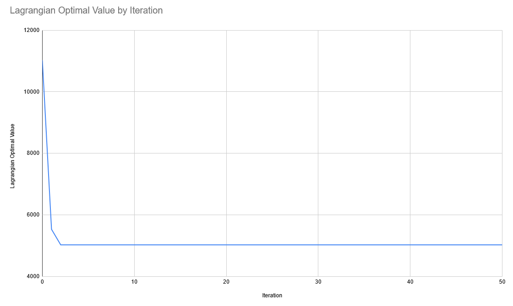

# CA4: Lagrangian Relaxation

## Info
**Course:** ORI391Q – Integer Programming

**Date:** 4/14/2023

**Authors:**<br/>
Hannah Amundson<br/>
Rohit Ashok<br/>
Rishi Dubey

## Problem Statement
There are two parts to this problem. (1) Generate a random integer program. (2) Solve any integer program by 
using Lagrangian Relaxation.

## Algorithm
### Part 1: Generate An Integer Program
This part is mostly in [DataGenerator.java](ca4/src/main/java/com/digit/app/DataGenerator.java) in the `create` function.

1. Take in a number of constraints desired and a number of variables desired.
1. For each constraint desired
   2. Randomly generate an integer `b` between 0 and 10.
   3. Randomly generate an integer `a_ij` between -10 and 30 for each variable in each constraint 40% of the time. The other
   60% of time, set `a_ij` as 0.
   4. Select less than equal to `Ax <= b` 70% of the time and select greater than equal to `Ax >= b` 30% of the time.
5. For each variable desired
   6. Randomly generate an integer `c` between -5 and 10 for the cost function.

### Part 2: Bound An Integer Program with Lagrange Relaxation
This part is the remainder of the code. It will be easiest to start in [App.java](ca4/src/main/java/com/digit/app/App.java) 
in the `create` function. First, generate an integer program with 10 constraints and 15 variables. We will then do the 
below algorithm for every `s=0,...,10`.

1. Create the Lagrange function `Z(u)`. Do this by taking the first `s` constraints from the original problem and adding
them as lagrangian functions.
2. Generate the first upper bound by running a Linear Programming relaxation on the data. Additionally, start with the 
lagrange multipliers being 1. Also, start with $\epsilon$ equal to 1.5. We chose this number because some research says 
that tends to have good convergence.
2. Do the following for a max of 90,000 rounds. We could technically continue doing it, but a cutoff is good in case 
there is a slow convergence.
   3. Calculate the new `c` value for the integer program given the lagrange multipliers, the original `c`, and the 
   lagrange optimization functions.
   4. Run the integer program with the remaining constraints and the new `c` value.
   5. Calculate the subgradient.
   6. If the subgradient is all 0, exit out. This means we found the optimal integer solution to the original 
   problem. The optimal solution and variable values are from the integer program that was just run.
   7. Given the $x^k$ that we just calculated in the integer program, calculate what the value would be for the original
   problem.
   8. If we've found a new lower upper bound, update the upper bound.
   9. Calculate the step value using $\epsilon$, the subgradient, the optimal value of the lagrangian from this iteration,
   and the best solution to the integer program so far.
   10. Using the step value, subgradient, and old lagrangian multipliers, update the lagrangian multipliers for the next
   round.
   11. If the lagrangian value hasn't increased in 4 iterations, halve $\epsilon$.
   12. If $\epsilon$ is less than 0.0005, exit out. This means we found the optimal integer solution to the original
       problem. The optimal solution and variable values are from the integer program that was just run.


## How To Run
This can be run from the jar file. First you need to create the jar file:

If you need to create the jar, from the `README.md` directory, do this:
```sh
cd ca4
mvn clean install
```
You then need to go to the folder of the jar file. From the location you are in after running maven, do the following:
```sh
cd target
```

You can then run the following from the terminal to get your results:
```sh
java -jar ca4-1.0-SNAPSHOT.jar
```

## Results
The results can be replicated with seed `-1549335653`.

### Table 1: s=5 Results
k| mu       |e|vs|Z_IP|Z_LR|L1|L2|L3|L4|L5
| --- |----------| --- | --- | --- | --- | --- | --- | --- | --- | --- |
|0| 0.000445 |1.500000|20268218.000000|9500.000000|11030.000000|1.00000|1.00000|1.00000|1.00000|1.00000|
|1| 0.000348 |1.500000|2202866.000000|5026.000000|5534.752298|0.33671|0.00000|1.00222|2.33725|1.00356|
|2| 0.000005 |1.500000|2202866.000000|5026.000000|5029.693687|0.00000|0.00000|1.00397|2.34422|1.00634|
|3| 0.000005 |1.500000|2202866.000000|5026.000000|5029.693728|0.00000|0.00000|1.00399|2.34432|1.00638|
|4| 0.000005 |1.500000|2202866.000000|5026.000000|5029.693770|0.00000|0.00000|1.00401|2.34441|1.00642|
|5| 0.000005 |1.500000|2202866.000000|5026.000000|5029.693811|0.00000|0.00000|1.00403|2.34450|1.00645|
|6| 0.000005 |1.500000|2202866.000000|5026.000000|5029.693852|0.00000|0.00000|1.00406|2.34459|1.00649|
|7| 0.000002 |0.750000|2202866.000000|5026.000000|5029.693893|0.00000|0.00000|1.00408|2.34468|1.00653|
|8| 0.000002 |0.750000|2202866.000000|5026.000000|5029.693914|0.00000|0.00000|1.00409|2.34473|1.00655|
|9| 0.000002 |0.750000|2202866.000000|5026.000000|5029.693935|0.00000|0.00000|1.00410|2.34477|1.00656|
|10| 0.000002 |0.750000|2202866.000000|5026.000000|5029.693955|0.00000|0.00000|1.00411|2.34482|1.00658|
|11| 0.000001 |0.375000|2202866.000000|5026.000000|5029.693976|0.00000|0.00000|1.00413|2.34487|1.00660|
|12| 0.000001 |0.375000|2202866.000000|5026.000000|5029.693986|0.00000|0.00000|1.00413|2.34489|1.00661|
|13| 0.000001 |0.375000|2202866.000000|5026.000000|5029.693997|0.00000|0.00000|1.00414|2.34491|1.00662|
|14| 0.000001 |0.375000|2202866.000000|5026.000000|5029.694007|0.00000|0.00000|1.00414|2.34493|1.00663|
|15| 0.000001 |0.187500|2202866.000000|5026.000000|5029.694017|0.00000|0.00000|1.00415|2.34496|1.00664|
|16| 0.000001 |0.187500|2202866.000000|5026.000000|5029.694022|0.00000|0.00000|1.00415|2.34497|1.00664|
|17| 0.000001 |0.187500|2202866.000000|5026.000000|5029.694027|0.00000|0.00000|1.00415|2.34498|1.00665|
|18| 0.000001 |0.187500|2202866.000000|5026.000000|5029.694033|0.00000|0.00000|1.00416|2.34499|1.00665|
|19| 0.000000 |0.093750|2202866.000000|5026.000000|5029.694038|0.00000|0.00000|1.00416|2.34500|1.00666|
|20| 0.000000 |0.093750|2202866.000000|5026.000000|5029.694040|0.00000|0.00000|1.00416|2.34501|1.00666|
|21| 0.000000 |0.093750|2202866.000000|5026.000000|5029.694043|0.00000|0.00000|1.00416|2.34501|1.00666|
|22| 0.000000 |0.093750|2202866.000000|5026.000000|5029.694046|0.00000|0.00000|1.00416|2.34502|1.00666|
|23| 0.000000 |0.046875|2202866.000000|5026.000000|5029.694048|0.00000|0.00000|1.00417|2.34503|1.00667|
|24| 0.000000 |0.046875|2202866.000000|5026.000000|5029.694049|0.00000|0.00000|1.00417|2.34503|1.00667|
|25| 0.000000 |0.046875|2202866.000000|5026.000000|5029.694051|0.00000|0.00000|1.00417|2.34503|1.00667|
|26| 0.000000 |0.046875|2202866.000000|5026.000000|5029.694052|0.00000|0.00000|1.00417|2.34503|1.00667|
|27| 0.000000 |0.023438|2202866.000000|5026.000000|5029.694053|0.00000|0.00000|1.00417|2.34504|1.00667|
|28| 0.000000 |0.023438|2202866.000000|5026.000000|5029.694054|0.00000|0.00000|1.00417|2.34504|1.00667|
|29| 0.000000 |0.023438|2202866.000000|5026.000000|5029.694055|0.00000|0.00000|1.00417|2.34504|1.00667|
|30| 0.000000 |0.023438|2202866.000000|5026.000000|5029.694055|0.00000|0.00000|1.00417|2.34504|1.00667|
|31| 0.000000 |0.011719|2202866.000000|5026.000000|5029.694056|0.00000|0.00000|1.00417|2.34504|1.00667|
|32| 0.000000 |0.011719|2202866.000000|5026.000000|5029.694056|0.00000|0.00000|1.00417|2.34504|1.00667|
|33| 0.000000 |0.011719|2202866.000000|5026.000000|5029.694056|0.00000|0.00000|1.00417|2.34504|1.00667|
|34| 0.000000 |0.011719|2202866.000000|5026.000000|5029.694057|0.00000|0.00000|1.00417|2.34505|1.00667|
|35| 0.000000 |0.005859|2202866.000000|5026.000000|5029.694057|0.00000|0.00000|1.00417|2.34505|1.00667|
|36| 0.000000 |0.005859|2202866.000000|5026.000000|5029.694057|0.00000|0.00000|1.00417|2.34505|1.00667|
|37| 0.000000 |0.005859|2202866.000000|5026.000000|5029.694057|0.00000|0.00000|1.00417|2.34505|1.00667|
|38| 0.000000 |0.005859|2202866.000000|5026.000000|5029.694058|0.00000|0.00000|1.00417|2.34505|1.00667|
|39| 0.000000 |0.002930|2202866.000000|5026.000000|5029.694058|0.00000|0.00000|1.00417|2.34505|1.00667|
|40| 0.000000 |0.002930|2202866.000000|5026.000000|5029.694058|0.00000|0.00000|1.00417|2.34505|1.00667|
|41| 0.000000 |0.002930|2202866.000000|5026.000000|5029.694058|0.00000|0.00000|1.00417|2.34505|1.00667|
|42| 0.000000 |0.002930|2202866.000000|5026.000000|5029.694058|0.00000|0.00000|1.00417|2.34505|1.00667|
|43| 0.000000 |0.001465|2202866.000000|5026.000000|5029.694058|0.00000|0.00000|1.00417|2.34505|1.00667|
|44| 0.000000 |0.001465|2202866.000000|5026.000000|5029.694058|0.00000|0.00000|1.00417|2.34505|1.00667|
|45| 0.000000 |0.001465|2202866.000000|5026.000000|5029.694058|0.00000|0.00000|1.00417|2.34505|1.00667|
|46| 0.000000 |0.001465|2202866.000000|5026.000000|5029.694058|0.00000|0.00000|1.00417|2.34505|1.00667|
|47| 0.000000 |0.000732|2202866.000000|5026.000000|5029.694058|0.00000|0.00000|1.00417|2.34505|1.00667|
|48| 0.000000 |0.000732|2202866.000000|5026.000000|5029.694058|0.00000|0.00000|1.00417|2.34505|1.00667|
|49| 0.000000 |0.000732|2202866.000000|5026.000000|5029.694058|0.00000|0.00000|1.00417|2.34505|1.00667|
|50| 0.000000 |0.000732|2202866.000000|5026.000000|5029.694058|0.00000|0.00000|1.00417|2.34505|1.00667|


### Graph: Lagrange Value in Terms by Iteration at s=5


### Table 2: All s Results
| variable\round |1|2|3|4|5|6|7|8|9|10|
|----------------| --- | --- | --- | --- | --- | --- | --- | --- | --- | --- |
| k_1            |1|1000|1000|44|2|5|1|1|1|2|
| k_2            |49|1000|1000|92|50|53|49|49|49|50|
| Z_LR           |5009.0|5015.802105373116|5020.909320111456|5022.962347729788|5029.693687135948|5029.077995373373|5015.173737243851|5017.177260840741|5022.198949433936|5019.6401389901985|
| L              |0.000000,|0.000000,0.971729,|0.000000,0.954660,1.045340|0.000875,0.000006,1.003937,2.342344|0.000000,0.000000,1.003965,2.344224,1.006344|0.000000,0.000000,1.003361,2.495457,1.005377,0.000000|0.000000,1.000856,1.004279,1.006847,1.006847,0.000000,0.994009|0.000000,1.000856,1.004282,1.006851,1.006851,0.000000,0.994006,1.001713|0.000000,1.000858,1.004288,1.006860,1.006860,0.000000,0.993997,1.001715,1.004288|0.000000,0.834288,1.004142,1.173168,1.006627,0.000000,1.521581,1.001657,0.837601,0.806531|
| x              |0.000000,0.000000,0.000000,0.000000,0.000000,0.000000,0.000000,500.000000,0.000000,0.000000,0.000000,0.000000,1.000000,0.000000,0.000000|0.000000,0.000000,0.000000,0.000000,0.000000,0.000000,0.000000,500.000000,0.000000,0.000000,0.000000,0.000000,1.000000,0.000000,0.000000|0.000000,0.000000,0.000000,0.000000,0.000000,0.000000,0.000000,500.000000,0.000000,-0.000000,0.000000,0.000000,1.000000,0.000000,0.000000|0.000000,0.000000,0.000000,0.000000,0.000000,0.000000,0.000000,500.000000,0.000000,0.000000,0.000000,0.000000,2.000000,1.000000,0.000000|0.000000,0.000000,0.000000,0.000000,0.000000,0.000000,0.000000,500.000000,0.000000,0.000000,0.000000,0.000000,2.000000,1.000000,0.000000,|0.000000,0.000000,0.000000,0.000000,0.000000,0.000000,0.000000,500.000000,0.000000,0.000000,0.000000,0.000000,2.000000,1.000000,0.000000,|0.000000,0.000000,0.000000,0.000000,0.000000,0.000000,0.000000,500.000000,0.000000,0.000000,0.000000,0.000000,0.000000,0.000000,0.000000,|0.000000,0.000000,0.000000,0.000000,0.000000,0.000000,0.000000,500.000000,0.000000,0.000000,0.000000,0.000000,0.000000,0.000000,0.000000,|0.000000,0.000000,0.000000,0.000000,0.000000,0.000000,0.000000,500.000000,0.000000,0.000000,0.000000,0.000000,0.000000,0.000000,0.000000,|0.000000,0.000000,0.000000,0.000000,0.000000,0.000000,0.000000,500.000000,0.000000,0.000000,0.000000,0.000000,0.000000,0.000000,0.000000|
| Subgradient    |-1492.000000|-1492.000000,-5.000000|-1492.000000,-5.000000,5.000000|-1484.000000,-11.000000,5.000000,20.000000|-1484.000000,-11.000000,5.000000,20.000000,8.000000|-1484.000000,-11.000000,5.000000,20.000000,8.000000,-1985.000000|-1492.000000,1.000000,5.000000,8.000000,8.000000,-1991.000000,-7.000000|-1492.000000,1.000000,5.000000,8.000000,8.000000,-1991.000000,-7.000000,2.000000|-1492.000000,1.000000,5.000000,8.000000,8.000000,-1991.000000,-7.000000,2.000000,5.000000|-1492.000000,1.000000,5.000000,8.000000,8.000000,-1991.000000,-7.000000,2.000000,5.000000,1.000000|


### Output
The output for this specific round can be found here: [output.txt](./output.txt).

## Learnings
I found it really helpful to implement a Lagrangian Relaxation because it gave me more clarity as to what was going on 
in it. One thing that really surprised me was how the rounds of `s` don't appear to be linear in solving the problem. 
For example, `s=3` takes a lot more iterations than both `s=1` and `s=10`. Another thing I learned was there are a lot 
of strategies for how to calculate the step function. Even when choosing the most common strategy, there was still
ambiguity about what the original $\epsilon$ should be and how many iterations we should use until we reduce it.

I found it interesting that CPLEX could solve the original integer program faster than the Larangian technique. I'm sure
this is not always the case. It made me wonder when each algorithm should be used. I'm also curious about what strategies
could be used to more intelligently select the constraints. I would be curious to do further research to learn how to 
classify a constraint as hard or easy, especially in relation to the other constraints.